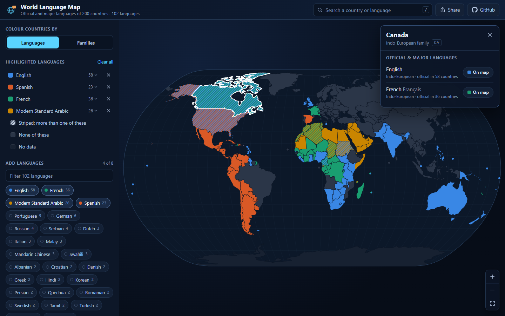
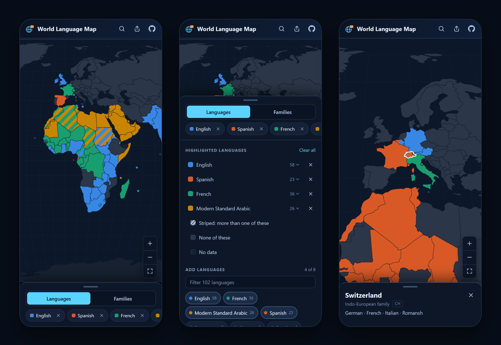
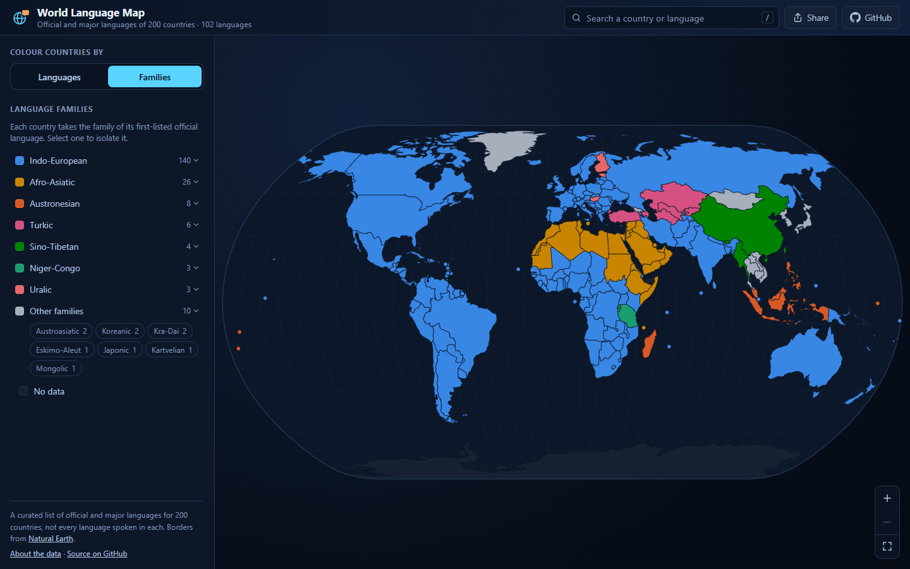

# World Language Map

An interactive map of where the world's languages are official. Pick any of 102
languages and every country that lists it lights up in that language's colour;
switch to language families and the map is coloured by family instead. Click or
tap a country for its languages, and share exactly what you are looking at: the
address bar always holds the current view.

**→ [skulitom.github.io/MapLanguageVisualizer](https://skulitom.github.io/MapLanguageVisualizer/)**



## What you can do

- **Highlight languages.** Choose as many as you like, from the list or the
  search box. A language keeps its colour while you add and remove others, and a
  country that lists more than one of them is striped in all of their colours:
  Canada in English and French, Chad in French and Arabic, the United States in
  English and Spanish. A first visit opens with the four most widespread
  (English, French, Arabic and Spanish) already highlighted.
- **See language families.** Colour every country by the family of its
  first-listed language. The seven largest families get their own colour and the
  seven smallest share a neutral; select any family in the legend to isolate it.
- **Look up a country.** Click a country for its official and major languages,
  their native names and families, and how many other countries share each one.
  Any of them can be added to the map from there.
- **Search anything.** One box finds countries and languages by English name,
  native name or ISO code (`sw`, `Kiswahili`, `SG`). Press <kbd>/</kbd> to jump to
  it; picking a country flies the map there.
- **Reach every country.** Countries too small for the base map (Singapore,
  Malta, Bahrain, the Caribbean and Pacific island states) are drawn as dots, and
  every legend entry opens a list of the countries behind it.
- **Share a view.** A link such as
  [`#langs=sw,pt&country=MZ`](https://skulitom.github.io/MapLanguageVisualizer/#langs=sw,pt&country=MZ)
  opens with Swahili and Portuguese highlighted and Mozambique selected. The
  Share button copies the link, or opens the share sheet on a phone.

## On a phone



The map takes the whole screen and opens zoomed in far enough to fill it,
centred on Europe and Africa. Pinch or use the buttons to zoom, and drag to pan.
The controls sit in a sheet along the bottom; tap or swipe its handle to open
it. Tapping a country shows its details in the same sheet, and search opens over
the header.

## Language families



Family mode takes each country's family from its **first-listed** language. That
keeps the map faithful to what the dataset records, but it matters when reading
it: wherever English, French, Spanish or Portuguese is listed first, the country
counts as Indo-European, which covers most of the Americas and much of Africa.
Kenya (English, Swahili) is Indo-European here, while Tanzania (Swahili,
English) is Niger-Congo.

## Keyboard

| Key | Does |
| --- | --- |
| <kbd>/</kbd> | Jump to the search |
| <kbd>↑</kbd> <kbd>↓</kbd> <kbd>Enter</kbd> | Pick a search result |
| <kbd>+</kbd> <kbd>−</kbd> <kbd>0</kbd> | Zoom in, zoom out, reset (map focused) |
| Arrow keys | Pan (map focused) |
| <kbd>Esc</kbd> | Close the country details |

## About the data

**Languages.** A curated list of official and major languages for 200 countries
and territories, 102 languages in all, kept in
[`scripts/prepare-language-data.ts`](scripts/prepare-language-data.ts). Each
country's languages are listed most prominent first. It is not a record of every
language spoken: Nigeria lists English only, and South Africa four of its
official languages (Afrikaans, English, Zulu and Xhosa). Arabic is recorded as
Modern Standard Arabic and Chinese as Mandarin.

**Borders.** [Natural Earth](https://www.naturalearthdata.com/) 1:110m admin-0
countries from the [`world-atlas`](https://github.com/topojson/world-atlas)
package, drawn in the Natural Earth projection. Countries too small to appear at
that scale are drawn as dots at the centre of their largest piece of land in the
1:50m atlas ([`scripts/prepare-country-points.ts`](scripts/prepare-country-points.ts));
Tuvalu and French Guiana, which have no shape of their own even at 1:50m, are
placed by hand. Kosovo is matched by name because the atlas gives it no ISO
code, and Northern Cyprus and Somaliland are shown without language data.

**Colours.** Selected languages take eight categorical colours in a fixed
order, then twenty more chosen to sit as far as possible from those and from
each other; a language keeps its colour until it is removed. Only the first
eight are checked for colour blindness. The family colours were assigned so that
every pair of families sharing a land border stays distinguishable under
protanopia and deuteranopia simulation. The legend, tooltips and country lists
name everything, so colour is never the only way to tell.

Found a wrong or missing language?
[Open an issue](https://github.com/skulitom/MapLanguageVisualizer/issues), or edit
`scripts/prepare-language-data.ts` and run `npm run data`.

## Running it locally

Needs Node.js 20.19+ or 22.12+.

```bash
npm install
npm run dev
```

| Script | Does |
| --- | --- |
| `npm run dev` | Dev server at http://localhost:5173 |
| `npm run build` | Type-check and build to `dist/` |
| `npm run preview` | Serve the production build |
| `npm run lint` | ESLint |
| `npm run data` | Regenerate `src/data/*.json` from the scripts in `scripts/` |

Every push to `master` is linted, built and deployed to GitHub Pages by
[`.github/workflows/deploy-pages.yml`](.github/workflows/deploy-pages.yml).

## How it is built

React 19, TypeScript and Vite. The map is one SVG:
[d3-geo](https://github.com/d3/d3-geo) projects the TopoJSON outlines once per
size, and [d3-zoom](https://github.com/d3/d3-zoom) handles wheel, drag, pinch and
double-tap zoom by transforming a single group, so panning never re-renders the
country shapes. There is no backend: the language data ships with the page and
the atlas loads as a separate chunk.

```text
src/
  App.tsx               state, URL sync, and the desktop and phone layouts
  components/map/       WorldMap (projection, zoom, dots, stripes), legend, tooltip
  components/controls/  search, mode switch, language picker, country details
  components/layout/    header, bottom sheet, share button
  data/                 the generated JSON and helpers over it
  hooks/, utils/        atlas loading, sizing, colours, search, URL state
scripts/                the language dataset and the dot positions
map_data/               Natural Earth 1:10m shapefiles, kept for reference (not used)
```

## Licence

Code is MIT (see [`LICENSE`](LICENSE)). Natural Earth data is in the public
domain, and `world-atlas` is ISC-licensed.
